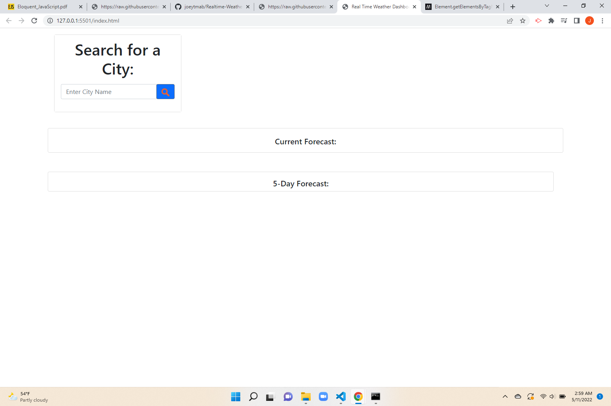
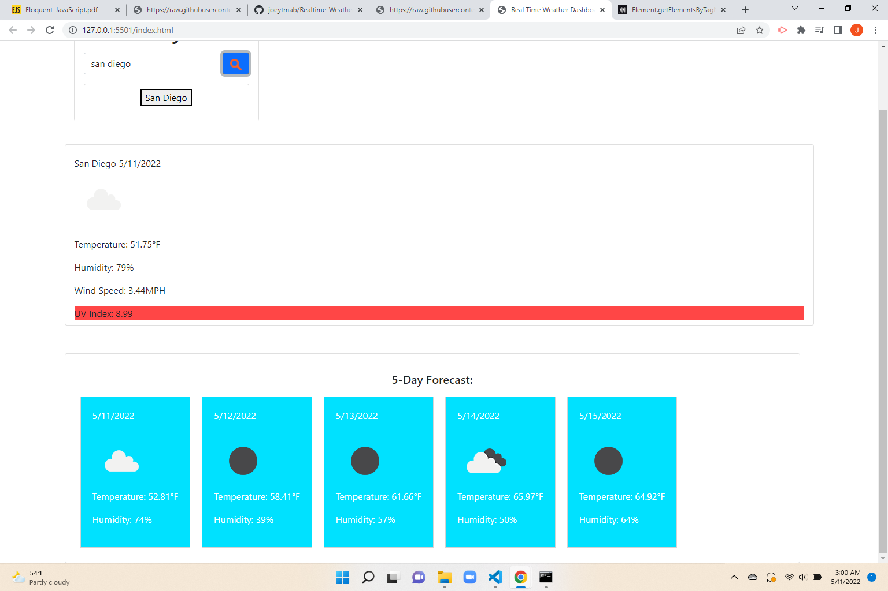
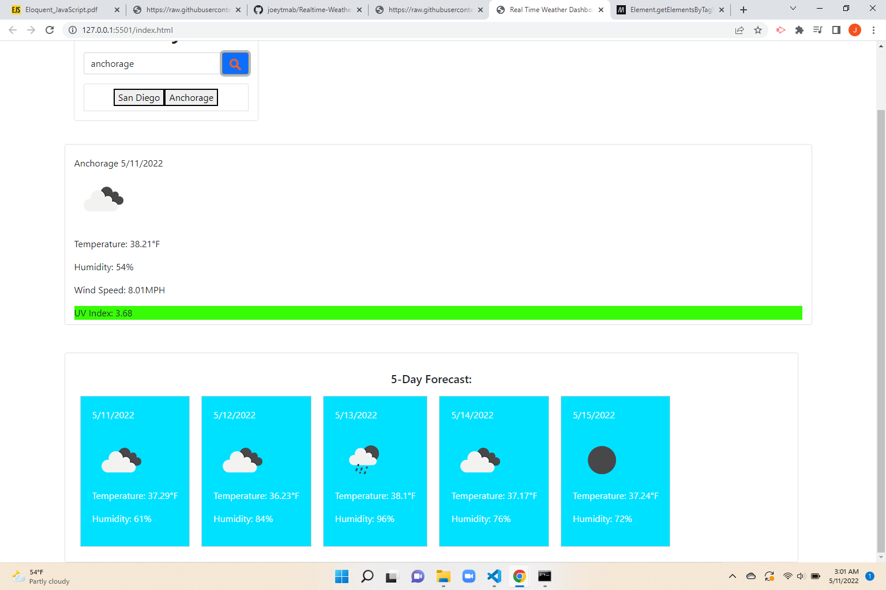

# Realtime-Weather-Dashboard

## Info Regarding This Project:

Weather Dashboard presents real-time weather conditions of a city, while also including the five-day forecast.

When searching for a city, current and future conditions are presented. This includes temperature, humidity, UV index, and wind speed, if any.

UV index will also portray three colors pertaining to UV dangers: red for high, yellow for moderate, and green for low UV ratings.

Finally, cities that are searched via the search input will be saved. From there, if the user needs to re-access information for previous cities requested, they can do so by clicking the buttons underneath the city search tool.

**Technologies Used:**

- HTML, CSS
- Javascript, JQuery, and AJAX
- Bootstrap CSS
- Open Weather API
- Docker

### Homepage

  

### Sample City 1: San Diego (High UV Index)

  

### Sample City 2: Anchorage (Low UV Index)

  

Link to Weather Dashboard: https://github.io/Realtime-Weather-Dashboard/
